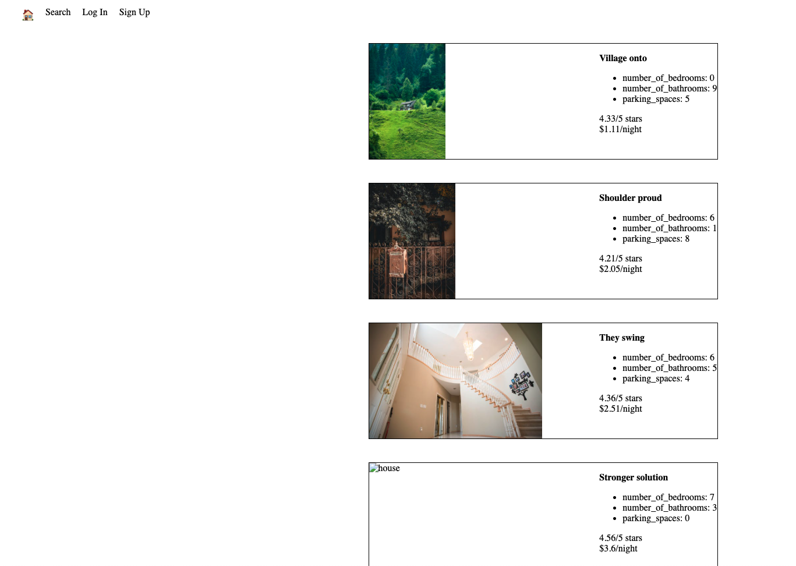

# LightBnB

## Description

LightBnB is a light verison of AirBnb. It allows users to rent their homes to people on vacation. This project is built during my studies at Lighthouse Labs.

## Screenshots

## Getting Started
1. Install dependencies using `npm install`
2. Start the web server using `npm run local`
3. Head to http://localhost:3000/ to view the app

## Using LightBnB
- If you don't have a user account, create one by clicking the "Sign Up" button
- Use the "Log In" button to login
- View properties by using the "Search" button, various filters can be applied
- Create a listing by using the "Create Listing" button
- View your listings with the "My Listings" button
- View your reservations with the "My Reservations" button
- Log Out with the "Log Out" button